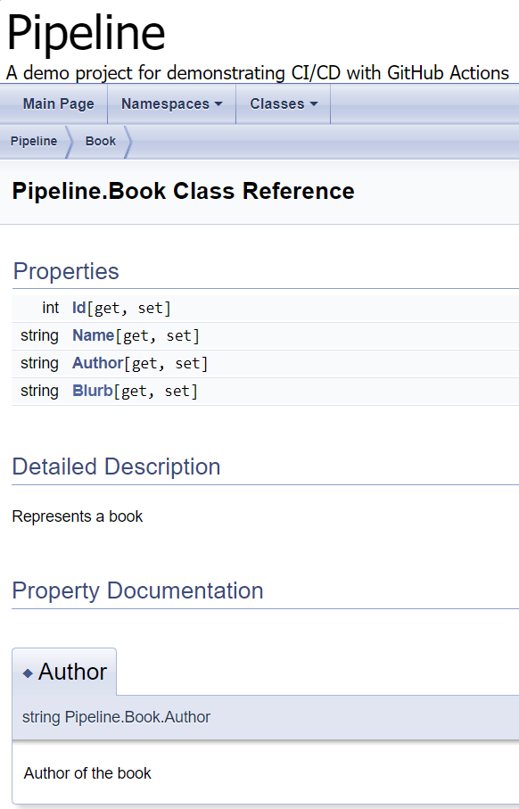

# Implementing a continuous integration pipeline with GitHub Actions 

This tutorial will demonstrate how you can create a continuous integration pipeline using Github Actions and set up some external tools that will be used in the pipeline. 

In this tutorial, you will learn how to:
*   Create a Github Actions workflow file.
*   Run your pipeline in the cloud.
*   Setup automated builds and testing.
*   Add useful external tools:
    *   Sonar static analysis
    *   Doxygen
    *   Database migration using entity framework

### Before you start
Before you start working through this tutorial, it might be useful to take a look at the notes about Continuous Integration/Deployment, and DevOps in general. This will explain the concepts we use in this tutorial. You can find these here: [DevOps notes](https://edinburgh-napier.github.io/remote_test/notes/unit7_devops/).

To work through the steps outlined in this document, you need to have a dotnet project. This pipeline should work with any dotnet project, but for the purpose of this module, make sure you have completed the first tutorial on setting up a MAUI project, which you can find here: [Getting started with MAUI](https://edinburgh-napier.github.io/remote_test/tutorials/csharp/maui/maui.html).

## 1. Github Actions

Setup (or assume) a github rep?
Public repo, so you don't incur costs

### Workflow File

In the root of your project (where your .git folder is) create a directory '.github/workflows'. Any .yml file in this folder will be interpreted as a pipeline in Github Actions. You can now create a file named 'workflow.yml', which will store all the instructions for your pipeline.

### Syntax

| Keyword   | Description   |
| --- | --- |
| on   | This is how you declare what events will cause the pipeline to run.   |
| jobs   | A collection of actions that represent one item in you pipeline.   |
| runs-on   | Declaration of which operating system will run your job.    |
| steps  | List of actions contained in a job.    |
| uses  | Call an existing action.    |
| run  | Run a command. Tip: You can run a sequence of commands using pipes.    |


``` yml
name: <Name of your pipeline> 

# What events cause the pipeline to run
on:
  push:
    branches:
      - master # Will only run when a change is made to master (including a merge)

jobs:
  <Name of job>:

    # Which OS the runner wil use
    runs-on: windows-latest

    # A list of steps to run
    steps:
      - name: <Name of step>
        run: echo "Some command" 
```
All syntax is available in the [Github Actions Documentation](https://docs.github.com/en/actions/writing-workflows/workflow-syntax-for-github-actions)

### Secrets and Variables

Sometimes, you may need environment variables or secrets in your pipeline. Github has a solution for this: Secrets & Variables.

> Something about secrets :)

## 2. Building and Testing .Net

Now that you have an understanding of the syntax used in workflow files, you should be able to setup a build step using the standard dotnet build command.

It's important to remember that all commands will be executed from the root of your project, so you may need to supply a path to your .csproj file.


``` yml
    - name: build
      run: dotnet build <path to .csproj file>
```

If you try to run this, it may not work because the runner is missing some important resources:
*   The Dotnet framework
*   Your repository code
*   The dependencies your program relies on


The first step of your pipeline will probably be checking out the code from your repo using the following action:
``` yml
    - uses: actions/checkout@v4 
```
This is an example of ... stored action thingy.


Now you can setup dotnet.

``` yml
    - name: Setup .NET
      uses: actions/setup-dotnet@v4
      with:
        dotnet-version: 8.0
```

Then you can restore the workloads your project needs to build (like MAUI):

``` yml
    - name: Restore workloads
      run: dotnet workload restore <Path to .csproj>
```

Side note:
    You might notice that you are reusing certain values throughout your pipeline, such as the path to your project file. To reduce reuse, you can set up a variable in github to make future modification more efficient.

    ...

Here is an example workflow file that automatically builds a MAUI app.

``` yml
name: Build MAUI App 

on:
  [pull_request]

jobs:
  build:
    runs-on: windows-latest

    steps:
    - uses: actions/checkout@v4
    
    - name: Setup .NET
      uses: actions/setup-dotnet@v4
      with:
        dotnet-version: 8.0

    - name: Restore workloads
      run: dotnet workload restore <path to .csproj>

    - name: build
      run: dotnet build <path to .csproj>
```

> When building a MAUI app, you might need to supply a --framework condition like: --framework net8.0

It might be useful to automatically test your code in pull requests, so that only valid changes will be merged into your project. To accomplish this you can add another step to run dotnet test.

``` yml
    - name: test
      run: dotnet test <path to solution>
```


## 3. External Tools


### Sonar
Make an account in [sonarcloud](https://www.sonarsource.com/products/sonarcloud/signup/)


Make a new organisation, you can import one form Github or make one manually in sonar cloud.

Setup a project in sonarcloud, making note of the token.

Make a variable in Github that stores the token provided by sonar cloud.


Add all this stuff to your workflow file.

``` yml
    #Setup a Java JDK
    - name: Set up JDK 17
      uses: actions/setup-java@v4
      with:
        java-version: 17
        distribution: 'zulu'

    #Cache Sonar Dependencies
    - name: Cache SonarCloud packages
      uses: actions/cache@v4
      with:
        path: ~/sonar/cache
        key: ${{ runner.os }}-sonar
        restore-keys: ${{ runner.os }}-sonar

    - name: Cache SonarCloud scanner
      id: cache-sonar-scanner
      uses: actions/cache@v4
      with:
        path: ./.sonar/scanner
        key: ${{ runner.os }}-sonar-scanner
        restore-keys: ${{ runner.os }}-sonar-scanner

    #Install the SonarCloud Scanner
    - name: Install SonarCloud scanner
      if: steps.cache-sonar-scanner.outputs.cache-hit != 'true'
      run: |
        mkdir -p ./.sonar/scanner
        cd ./Pipeline
        dotnet tool update dotnet-sonarscanner --tool-path ../.sonar/scanner

    - name: Start Sonar Analysis
      env:
        SONAR_TOKEN: ${{ secrets.SONAR_TOKEN }}
      run: |
        ./.sonar/scanner/dotnet-sonarscanner begin /k:<key>" /o:"<organisation>" /d:sonar.token="${{ secrets.SONAR_TOKEN }}" /d:sonar.host.url="https://sonarcloud.io" /d:sonar.scanner.scanAll=false /d:sonar.cs.vscoveragexml.reportsPaths=coverage.xml

    #Build and test steps here
    #
    #
    #

    - name: End Sonar Analysis
      env:
        SONAR_TOKEN: ${{ secrets.SONAR_TOKEN }}
      run: ./.sonar/scanner/dotnet-sonarscanner end /d:sonar.token="${{ secrets.SONAR_TOKEN }}"

```

### Doxygen

Doxygen is a tool that generates a web-based representation of your project's documentation. It takes the comments from your code and produces HTML files with all of the details.




It might be best to create a new workflow file that runs only on pushes to master, so that your documentation site is not updated with anything outside of your main branch.

``` yml
name: Documentation 

on:
  push:
    branches:
      - master

jobs:
  generate:
    runs-on: ubuntu-latest

    steps:
    - uses: actions/checkout@v4

    - name: Install Doxygen
      run: sudo apt-get install doxygen -y

    - name: Generate Doxygen Documentation
      run: doxygen <path to Doxygen file>
```

This job generates the documentation but it would be better if we could access it from the web. To do this, you can use Github pages by uploading the generated artifacts and then deploying to Github pages.

First you must add a step to the 'generate' job which uploads the artifacts to Github pages:

> You will need write permissions for the job to access Github pages.


``` yml
    permissions:
      pages: write
      id-token: write

    - name: Upload static files as artifact
      uses: actions/upload-pages-artifact@v3 
      with:
        path: html
```


You should add a new job called 'deploy' after the generation job with the following contents.

``` yml
  deploy:
    needs: generate
    runs-on: ubuntu-latest
    permissions:
      pages: write
      id-token: write

    environment:
      name: github-pages
      url: ${{ steps.deployment.outputs.page_url }}

    steps:
      - name: Deploy to GitHub Pages
        id: deployment
        uses: actions/deploy-pages@v4
```


### Database Migration

After updating the datamodels in your application, you can use entity framework to migrate those changes into your database.


``` yml
- name: Migrate Database
  run: |
      dotnet ef migrations add ${{ github.run_number }}
      dotnet ef database update
```

