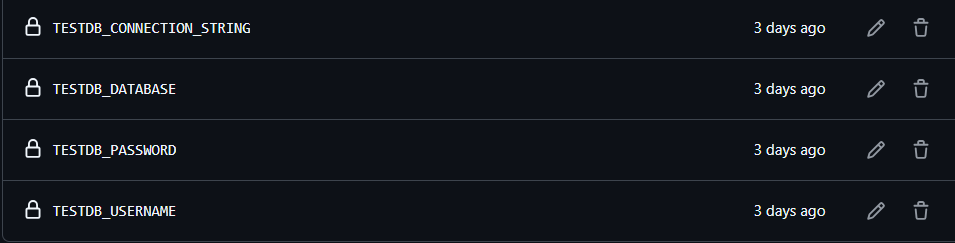

We managed to get migrations working with a local database that gets set up on the workflow runner. 

The file to use with this:

```yml
name: Build & Test # the name can be anything else you want

on: 
  [pull_request]

jobs:
  build: # this is just a name of the job, it can be changed to something else if you wish
    
    runs-on: windows-latest

    steps:
    - name: Checkout code
      uses: actions/checkout@v4
      
    - name: Download SqlServer
      uses: potatoqualitee/mssqlsuite@v1.7
      with:
        install: sqlengine, sqlpackage

    - name: Run sqlclient
      run: sqlcmd -S localhost -U sa -P dbatools.I0 -d tempdb -Q "SELECT @@version;"

    - name: Setup .NET
      uses: actions/setup-dotnet@v4
      with:
        dotnet-version: 8.0

    - name: Restore workloads
      run: dotnet workload restore ./Pipeline/Pipeline/Pipeline.csproj

    - name: Restore dependencies
      run: dotnet restore ./Pipeline/Pipeline/Pipeline.csproj

    - name: Install Tools
      run: |
        dotnet tool install --global dotnet-ef
        dotnet tool install --global dotnet-coverage

    # Setup a Java JDK
    - name: Set up JDK 17
      uses: actions/setup-java@v4
      with:
        java-version: 17
        distribution: 'zulu'

    # Get the SonarCloud dependencies from cache
    - name: Cache SonarCloud packages
      uses: actions/cache@v4
      with:
        path: ~/sonar/cache
        key: ${{ runner.os }}-sonar
        restore-keys: ${{ runner.os }}-sonar

    # Get the SonarCloud scanner from cache
    - name: Cache SonarCloud scanner
      id: cache-sonar-scanner
      uses: actions/cache@v4
      with:
        path: ./.sonar/scanner
        key: ${{ runner.os }}-sonar-scanner
        restore-keys: ${{ runner.os }}-sonar-scanner

    # Install the SonarCloud Scanner
    - name: Install SonarCloud scanner
      if: steps.cache-sonar-scanner.outputs.cache-hit != 'true'
      run: |
        mkdir -p ./.sonar/scanner
        cd ./Pipeline
        dotnet tool update dotnet-sonarscanner --tool-path ../.sonar/scanner

    - name: Start Sonar Analysis
      env:
        SONAR_TOKEN: ${{ secrets.SONAR_TOKEN }}
      run: |
        ./.sonar/scanner/dotnet-sonarscanner begin /k:"PipelineTest123_pipeline-sample" /o:"pipelinetest123" /d:sonar.token="${{ secrets.SONAR_TOKEN }}" /d:sonar.host.url="https://sonarcloud.io" /d:sonar.scanner.scanAll=false /d:sonar.cs.vscoveragexml.reportsPaths=coverage.xml

    - name: Build project
      env:
        ConnectionStrings__BooksDb: ${{ secrets.TestDb_CONNECTION_STRING }}
      run: dotnet build ./Pipeline/Pipeline/Pipeline.csproj --framework net8.0

    - name: Test Migration
      run: |
        dotnet ef migrations add ${{ github.run_number }} --project ./Pipeline/Pipeline/Pipeline.csproj
        dotnet ef database update --connection "${{ secrets.TestDb_CONNECTION_STRING }}" --project ./Pipeline/Pipeline/Pipeline.csproj

    - name: test
      env:
        ConnectionStrings__BooksDb: ${{ secrets.TestDb_CONNECTION_STRING }}
      run: dotnet-coverage collect "dotnet test ./Pipeline/Pipeline.sln --framework net8.0" -f xml -o "coverage.xml"

    - name: End Sonar Analysis
      env:
        SONAR_TOKEN: ${{ secrets.SONAR_TOKEN }}
      run: ./.sonar/scanner/dotnet-sonarscanner end /d:sonar.token="${{ secrets.SONAR_TOKEN }}"
```

Three secrets must be added for this to work:


    
