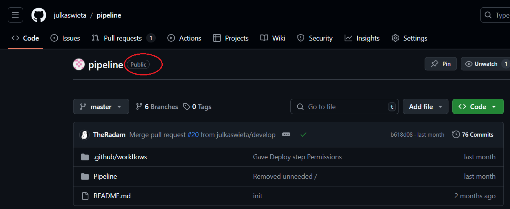
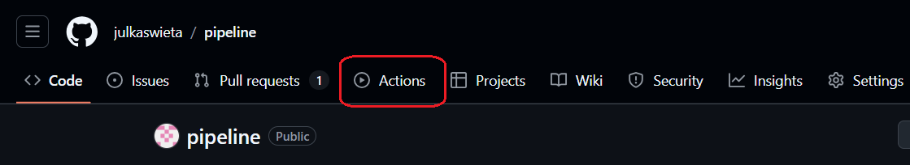
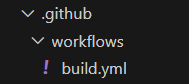
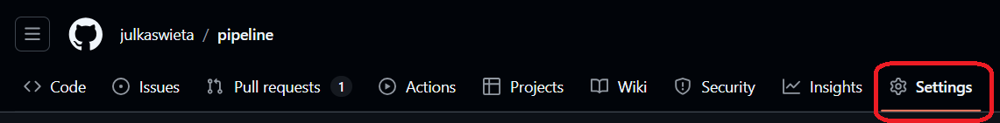
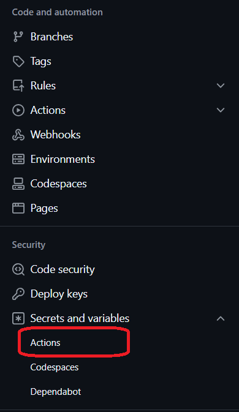
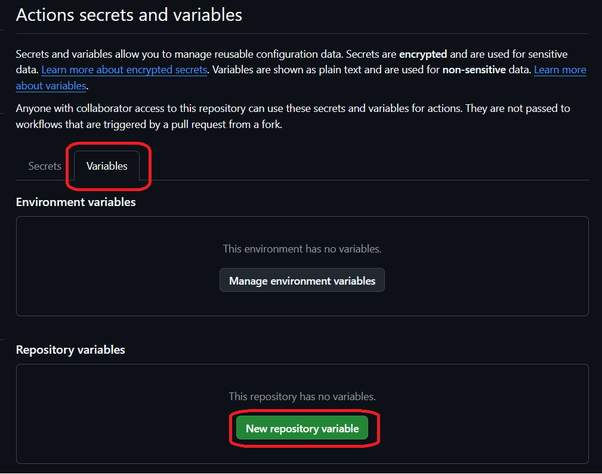
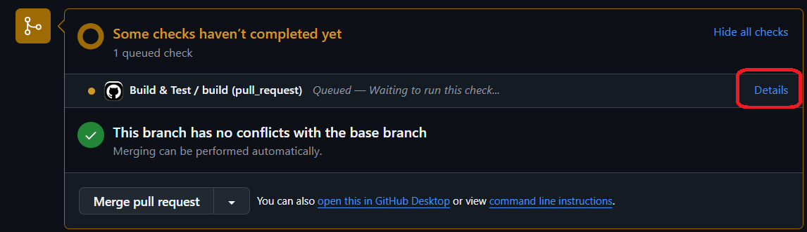
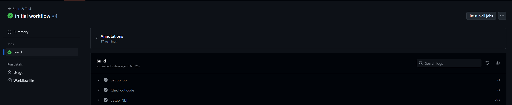

# CI/CD with GitHub Actions

This tutorial will demonstrate how you can create a continuous integration pipeline using GitHub 
Actions and set up some external tools that will be used in the pipeline. 

In this tutorial, you will learn how to:

*   Create a GitHub Actions workflow file.
*   Run your pipeline in the cloud.
*   Set up automated builds and testing.

## Before you start

Before you start working through this tutorial, make sure you understand what Continuous Integration and Deployment are. You can find this in your lecture notes/slides.

To work through this tutorial, you **must have your application code stored in a GitHub repository** because we will be us GitHub Actions.


## 1. GitHub Actions
GitHub Actions is a powerful CI/CD solution integrated into GitHub repositories. It allows 
developers to create workflows that run when certain events occur within a repository. A workflow 
is GitHub's name for a pipeline. For example, you can have a workflow that runs anytime new code 
is pushed to the master branch and checks whether the code builds and runs correctly. 

GitHub Actions can be used for free by anyone as long as the project is open-source. That means 
that the repository that hosts your code must be **public**. Otherwise, every workflow run incurs 
additional costs.

You can check that your repository for this project is public by going to its main page in 
GitHub. If it is, a "Public" badge will be displayed next to the repository's name.



### Workflow File
Creating a standard workflow in GitHub Actions is easy. GitHub provides a wide array of templates 
for creating a new workflow. It can even suggest the most suitable template based on the languages 
you use in your project.  In every GitHub repository, there is an **Actions** tab where you can 
set up a new workflow or monitor your current ones. 



In this tutorial, you will write your own workflow file from scratch to get an in-depth 
understanding of what each line does. If you decide you want to know a bit more about Actions, 
GitHub has a very comprehensive documentation, which you can find here: 
[GitHub Actions documentation](https://docs.github.com/en/actions). 

Every workflow file is in the YAML format, which is commonly used for configuration and uses 
minimal syntax. YAML files can have either the .yaml or .yml extension. Both are accepted by 
GitHub Actions - the choice is personal preference. 

### Syntax
Even though most CI/CD runners use YAML files for their step definitions, each requires a 
different syntax. GitHub Actions is event-oriented, which means that it defines the event that 
will trigger the jobs first. The table below outlines different keywords used in GitHub's 
workflow files that will be used in this tutorial. A full list is available in the documentation: 
[GitHub Actions Syntax Docs](https://docs.github.com/en/actions/writing-workflows/workflow-syntax-for-github-actions).

| Keyword         | Description                                                                                                                                                                   |
|-----------------|-------------------------------------------------------------------------------------------------------------------------------------------------------------------------------|
| **name**        | Sets the name of the workflow, which is used by GitHub Actions to identify specific workflows.                                                                                |
| **on**          | Declares what events will cause the pipeline defined in the file to run. There can be one or more of these. Examples of events include pushes or pull requests.               |
| **jobs**        | A collection of high-level stages in the pipeline. Each job has a set of steps to execute. For example, you can have a build job and a deploy job.                            |
| **runs-on**     | Specifies which operating system will run your job.                                                                                                                           |
| **steps**       | List of steps contained in a job. Each step starts with `- name: <name of step>`. Each step has its own commands to run or configurations to set up.                          |
| **uses**        | Specifies an existing action to be used within the step. They can come from GitHub's marketplace or a repository.                                                             |
| **run**         | Runs a command or script. Tip: You can run a sequence of commands using pipes.                                                                                                |

Here is a template for a basic workflow file:

``` yml
name: <Name of your pipeline> 

# What events cause the pipeline to run
on:
  push:
    branches:
      - master # Will only run when a change is made to master (including a merge)

jobs:
  <Name of job>:

    # The OS that the runner will use
    runs-on: windows-latest

    # A list of steps to run
    steps:
      - name: <Name of step>
        run: echo "Some command" 
```

## 2. Basic workflow setup
Now that you understand the syntax used in workflow files, you can move on to implementing your 
own workflow. 

The first step will be to create a new branch in your repository. If you are not sure how to do it, check out one of these tutorials: [Creating a branch from Visual Studio](https://learn.microsoft.com/en-us/visualstudio/version-control/git-create-branch?view=vs-2022) | [Creating a new branch from command line](https://www.w3schools.com/git/git_branch.asp?remote=github). 

> [!CAUTION]
> Make sure you are working on the newly created branch before proceeding. Use `git checkout <branch-name>` to switch between branches.

### Setting up your workflow file
To set up your first GitHub Actions workflow manually:
1. Create a `.github` directory in the root folder of your repository (note the leading dot) 
2. Then, create a `workflows` directory inside the `.github` folder. 
3. Finally, create a file named `build.yml` which will store all instructions for your pipeline. **Any `.yml` or 
`.yaml` file in this folder will be interpreted as a workflow in GitHub Actions.** This file structure is defined by GitHub and must be followed to trigger automatic runs.

Your file structure should look like this:



The first step in creating pipelines is deciding what events will trigger the runs. It could run 
anytime something is pushed to any of the branches, or only to some selected branches. Another 
option is to run the workflow on pull requests, which we will use as an example in this tutorial. 
A full breakdown can be found in the documentation: [Triggering a workflow](https://docs.github.com/en/actions/writing-workflows/choosing-when-your-workflow-runs/triggering-a-workflow). 

**Start defining you workflow by putting the following code in the `build.yml` file:**

```yml
name: Build & Test Workflow

on: 
  [pull_request]
```

The name of your workflow can be anything you want so feel free to replace **Build & Test Workflow** with something else of your choosing.

> [!IMPORTANT]
> Indentation plays an important role in `.yaml/.yml` files so make sure you copy the code correctly.

### Setting up the environment
1. Now that you have defined when the workflow will be triggered, you can move on to defining what **jobs** and **actions** will be executed in the workflow. You also need to decide what operating system will be used for the runner. For this project, we will use the lastest version of Windows. 

    Add this code to your workflow file:

    ```yml
      name: Build & Test Workflow

      on: 
        [pull_request]

      jobs:
        build:
          
          runs-on: windows-latest
    ```

    > [!NOTE]
    > Even though it may seem that **build** is a keyword in the code above, it is not. It is just a name of a job. As we've explained, you can have many jobs in your workflow file, and each needs a name, which can be anything, so feel free to change it to experiment. Since this job's primary function is to build the code, we have chosen **build** as the name.

2. You can start defining the order of the steps in the job. Usually, the starting point is ensuring that the workflow can access the source code. In GitHub Actions, you can use a **standard action** that checks out the code from the repository. 

    Update your code to look like this:

    ```yml
    name: Build & Test Workflow

    on: 
          [pull_request]
    jobs:
      build:

        runs-on: windows-latest

        steps:
        - name: Checkout code
          uses: actions/checkout@v4
    ```

The next step is ensuring that the environment is set up properly and all tools needed to build the code are installed. In .NET projects, this involves setting up the .NET SDK, and restoring workloads and dependencies. 

3. To set up the SDK, you can use a standard action and provide it with the version of .NET that you require, in this case 8.0. Add this code below the previous step:

    ``` yml
        - name: Setup .NET
          uses: actions/setup-dotnet@v4
          with:
            dotnet-version: 8.0
    ```

4. To restore .NET workloads, add this step, making sure you provide the path to the Notes.csproj file:

    ```yml
        - name: Restore workloads
          run: dotnet workload restore <Path to .csproj>
    ```

    Workloads in .NET projects are various additional tools, libraries or features that are not included in the SDK by default. They are defined in the `.csproj` file so the command needs a correct path to that file. 

> [!IMPORTANT]
> It's important to remember that all commands in the workflow will be executed from the root of your project, so you must supply a relative path to your `.csproj` file, e.g. `./Notes/Notes.csproj`. Make sure the paths are relative to the root of the project, not the workflows folder. 

5. Apart from restoring workloads, you must also restore dependencies to ensure the project works properly. Add this step and again make sure the path to the main `.csproj` file is correct

    ```yml
        - name: Restore dependencies
          run: dotnet restore <Path to .csproj>
    ```

### Building the project
Now that you've got the source code checked out and the environment set up, you can move on to building the project. **Add the following build step to your workflow:**

    ``` yml
        - name: Build project
          run: dotnet build <path to .csproj file> 
    ```

### Testing the code
Testing is a critical element of any CI/CD pipeline. Automatically running a suite of tests speeds up development significantly, while ensuring that the application remains fully functional and the recent changes have not introduced any bugs (or at least the bugs covered by tests).

In GitHub Actions, you can run tests as part of the workflow. Usually, you'll want to have a separate step for this after the build step. To test a .NET project, you can use the following command, which will run all tests included in the entire solution. 

> [!CAUTION]
> In all previous steps, you needed a path to the `.csproj` file, but in this case, it's the `.sln` file because tests will usually be defined in a separate project that makes use of the base project. The solution file brings them both together so they can communicate. 

**Add this code to the bottom of your workflow:**

``` yml
    - name: test
      run: dotnet test <path to your notes.sln>
```

### Checkpoint
At this point, your workflow file should look like this (the paths to the `.csproj` and `.sln` files will be different):

```yml
name: Build & Test Workflow

on: [pull_request]
    
jobs:
    build:
        runs-on: windows-latest
        
        steps:
        - name: Checkout code
          uses: actions/checkout@v4
          
        - name: Setup .NET
          uses: actions/setup-dotnet@v4
          with: 
            dotnet-version: 8.0
            
        - name: Restore workloads
          run: dotnet workload restore ./Notes/Notes.csproj
          
        - name: Restore dependencies
          run: dotnet restore ./Notes/Notes.csproj
             
        - name: Build project
          run: dotnet build ./Notes/Notes.csproj

        - name: test
          run: dotnet test ./Notes.sln
```
### Optional: Adding environment variables to GitHub

> [!NOTE]
> This part of the tutorial is optional - you can skip it if you want.

You might notice that you are reusing certain values throughout your pipeline, such as the path to your project file. To encourage reuse, you can set up a variable in GitHub to make future modifications more efficient.

1. To add a variable, navigate to the Settings tab in the repository 

    

2. In the menu on the left, navigate to `Secrets and variables` > `Actions`

    

3. Switch to the `Variables` tab and select `New repository variable`.

    

4. This will take you to a page where you give a name to your variable, e.g. `CSPROJ_PATH`, and the value, which is the path to your `.csproj` file in this example. **Note: the path in the screenshot is just an example.**

    

After you add the variable in GitHub, you can use it in your workflow file like this:

```
${{ vars.CSPROJ_PATH }}
```

So if you wish to replace your paths with the environment variable, you can replace them with the syntax above, for example, your build step could look like this:

```yml
 - name: Build project
   run: dotnet build ${{ vars.CSPROJ_PATH }}
```

Go ahead and replace all paths to the `.csproj` file in your workflow.

**This is the end of the optional part of the tutorial**

## 3. Checking whether your pipeline works
At this point, your workflow should be set up to successfuly build and test the project. 

1. Commit your changes and push them to the remote repository. 

> [!CAUTION]
> As we have said at the beginning, please make sure you commit the changes to a new branch, **not the main branch**. Since the workflow is set up to be triggered on a pull request, this is necessary. If you have not created a new branch yet, you can still do it now.

2. Open a pull request to merge your changes to the main branch. If you don't know how to do this, check out this [tutorial](https://docs.github.com/en/pull-requests/collaborating-with-pull-requests/proposing-changes-to-your-work-with-pull-requests/creating-a-pull-request) or ask for help.

3. If your workflow is set up correctly, you should be able to see the newly trigerred workflow on the pull request page after a few seconds. If you click on `Details`, it will take you to the summary of the run in the Actions tab.

    

4. You should see a screen similar to this: 

    

    In the panel on the left, from the top, you can see:
    - the name of the workflow, 
    - the name of the pull request the run is part of and the status of the entire workflow
    - Summary tab
    - list of jobs with their statuses
    - Run details such as resource usage and the workflow file that was used for the run

    If all statuses are green, that means your pipeline ran successfully. 

    In the bigger panel on the right, you can see a list of steps that were executed in the run. Have a look at it to verify that all steps you expect to see are there. You can expand each step to see what its output was by pressing the `>` next to the step's name.

> [!NOTE]
> Note that it takes several minutes to complete the workflow due to the setup steps. 

At this point, your workflow should run successfully, building and testing your project. 